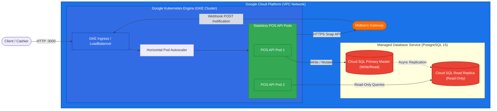
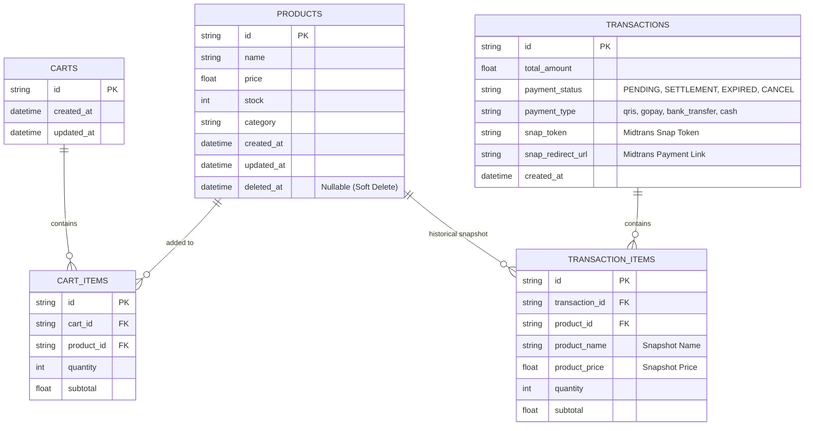

# Simple POS API with Terraform & GCP


Implementation of a RESTful **Point of Sale (POS)** API built using **Golang (Echo Framework)** structured with **Idiomatic Go Layout**, containerized with **Docker**, orchestrated on **Google Kubernetes Engine (GKE)**, and automatically deployed to **Google Cloud Platform (GCP)** using **Terraform (Infrastructure as Code)**.

---

## 🏗️ Architecture Overview

Decoupled, cloud-native microservice architecture orchestrated on **GKE (Google Kubernetes Engine)** with Horizontal Pod Autoscaler (HPA) and managed **Cloud SQL**:



---

## 📊 Database Schema & ERD

Diagram entitas dan relasi data pada sistem POS:



---

## 📁 Project Structure (Idiomatic Go Layout)

This repository follows the [Standard Go Project Layout](https://github.com/golang-standards/project-layout) and adheres to [Effective Go Idiomatic Guidelines](https://go.dev/doc/effective_go):

```text
simple-pos-with-terraform/
├── cmd/
│   └── api/
│       └── main.go              # Main application entrypoint
├── internal/                    # Private application & domain logic
│   ├── handler/                 # HTTP Handlers (Echo Controllers)
│   ├── model/                   # Data Models & DTOs
│   ├── repository/              # Data persistence / storage layer
│   └── service/                 # Business logic / domain rules
├── k8s/                         # Kubernetes Manifests (GKE Deployment)
│   ├── deployment.yaml          # GKE API Pod deployment
│   ├── service.yaml             # LoadBalancer Service
│   ├── configmap.yaml           # App configuration
│   ├── secret.yaml              # Database & Midtrans secret keys
│   └── hpa.yaml                 # Horizontal Pod Autoscaler (Autoscaling)
├── migrations/                  # Database migration scripts (golang-migrate)
│   ├── 000001_create_pos_tables.up.sql
│   └── 000001_create_pos_tables.down.sql
├── terraform/                   # Infrastructure as Code (GCP)
│   ├── main.tf                  # GCP GKE Cluster, VPC, & Cloud SQL
│   ├── variables.tf             # GCP Project, Region, Zone variables
│   ├── outputs.tf               # Public IP & Cluster endpoints
│   └── terraform.tfvars.example # Local environment variable example
├── Dockerfile                   # Multi-stage Docker build for Golang binary
├── docker-compose.yml           # Container orchestration for local environment
├── .gitignore                   # Git ignore rules
└── README.md                    # Project documentation
```

---

## 🌐 API Specifications

### 1. System & Health Check
| Method | Endpoint | Description | Status Code |
| :--- | :--- | :--- | :--- |
| `GET` | `/health` | Application & database health check status | `200 OK` |

### 2. Product Management (CRUD with Soft Delete)
| Method | Endpoint | Description | Status Code |
| :--- | :--- | :--- | :--- |
| `GET` | `/api/v1/products` | Retrieve active products list (`deleted_at == null`) | `200 OK` |
| `GET` | `/api/v1/products/:id` | Retrieve product detail by ID | `200 OK` |
| `POST` | `/api/v1/products` | Create a new product | `201 Created` |
| `PUT` | `/api/v1/products/:id` | Update product details, price, or stock | `200 OK` |
| `DELETE` | `/api/v1/products/:id` | **Soft delete** product (sets `deleted_at` timestamp) | `200 OK` |

### 2. Cart Management
| Method | Endpoint | Description | Status Code |
| :--- | :--- | :--- | :--- |
| `GET` | `/api/v1/cart` | View items and total in current cashier cart | `200 OK` |
| `POST` | `/api/v1/cart/items` | Add item or update quantity in cart | `200 OK` |
| `DELETE` | `/api/v1/cart/items/:product_id` | Remove specific item from cart | `200 OK` |
| `DELETE` | `/api/v1/cart` | Clear all items from cart | `200 OK` |

### 4. Checkout & Payment Gateway (Midtrans Integration)
| Method | Endpoint | Description | Status Code |
| :--- | :--- | :--- | :--- |
| `POST` | `/api/v1/checkout` | Process checkout from cart & generate Midtrans Snap Payment Token/QRIS | `200 OK` |
| `POST` | `/api/v1/payments/notification` | **Midtrans Webhook Callback** for asynchronous payment status updates | `200 OK` |
| `GET` | `/api/v1/transactions` | Retrieve sales transaction history | `200 OK` |
| `GET` | `/api/v1/transactions/:id` | Retrieve detailed transaction receipt | `200 OK` |
| `GET` | `/api/v1/transactions/:id/status` | Check live payment status from Midtrans | `200 OK` |

---

## 💳 Midtrans Payment Gateway Integration Guide

### 1. Midtrans Sandbox Account Setup
1. Register or log in to the [Midtrans Sandbox Dashboard](https://dashboard.sandbox.midtrans.com/).
2. Navigate to **SETTINGS** -> **Access Keys** to obtain your `Server Key` and `Client Key`.
3. Configure environment variables in your `.env` file:
   ```env
   MIDTRANS_SERVER_KEY=SB-Mid-server-YOUR_SANDBOX_SERVER_KEY
   MIDTRANS_CLIENT_KEY=SB-Mid-client-YOUR_SANDBOX_CLIENT_KEY
   MIDTRANS_IS_PRODUCTION=false
   ```

### 2. Webhook Notification Setup
To receive automated payment status updates from Midtrans (e.g. when a QRIS payment is settled):
1. In the Midtrans Dashboard, navigate to **SETTINGS** -> **Configuration**.
2. Set **Payment Notification URL** to:
   ```text
   http://<YOUR_GCP_VM_PUBLIC_IP>:3000/api/v1/payments/notification
   ```
3. Save configuration. When a customer completes a payment, Midtrans sends an HTTP `POST` payload to your backend, which verifies Midtrans Signature Key, marks transaction status as `SETTLEMENT`, and deducts product stock.

---

## 🛠️ Prerequisites

Ensure the following tools are installed on your environment before running this project:

- **Go** (v1.22+)
- **Docker Desktop** & **Docker Compose**
- **Terraform CLI** (v1.5+)
- **Google Cloud SDK (`gcloud CLI`)**
- Active **Google Cloud Platform (GCP)** account

---

## 🚀 Local Development

### 1. Run Native Go Application
```bash
# Download dependencies
go mod tidy

# Start application server
go run cmd/api/main.go
```
The server will be available at `http://localhost:3000`.

### 2. Run with Docker Compose
```bash
docker-compose up --build -d
```

---

## ☁️ Infrastructure Deployment (GCP via Terraform)

Step-by-step guide to provision infrastructure on GCP using Terraform:

### 1. Authenticate GCP & Set Project
```bash
gcloud auth application-default login
gcloud config set project YOUR_GCP_PROJECT_ID
```

### 2. Execute Terraform Lifecycle
```bash
cd terraform

# Initialize GCP Provider
terraform init

# Review Execution Plan
terraform plan

# Apply Infrastructure Changes to GCP
terraform apply
```

### 3. Teardown / Resource Destruction
To clean up all GCP resources and teardown infrastructure:
```bash
terraform destroy
```

---

## 👤 Author

- **Bambang Handoko** - [@goesbams](https://github.com/goesbams)
